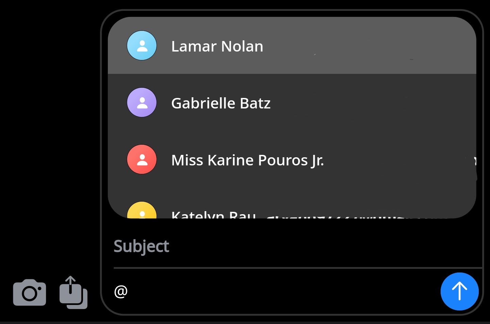

# BlueBubbles 1.12 - Deimos

### Tasker integration, mentions, and more with BlueBubbles v1.12

BlueBubbles App 1.12 brings exciting new features to client apps, while fixing a handful of bugs from previous versions and bringing a few small improvements to make the overall experience better.

Better yet, our dedicated desktop app is finally catching up! A v1.12 beta is available now in the Discord, and expect a stable release soon.

Let's dive into some of the new features.

## Mentions

BlueBubbles has had the capability of displaying mentions for some time, but 1.12 now brings the ability to send mentions! This uses Apple's native protocol for mentions, so iDevice users who have notifications silenced will get forcefully notified if you mention them in the chat.

<figure><figcaption></figcaption></figure>

Simply type `@` in the text field to start creating a mention, and BlueBubbles will automatically display a list of participants in the chat to mention. Tap one, and the text field uses an iMessage-esque gradient to indicate you've created a mention.

<figure><figcaption></figcaption></figure>

You can mention as many participants as you want in a single message, and removing a mention is as easy as selecting it, and tapping `Remove Mention`. We've even got the ability to customize the mentioned text to whatever you want (yep, even Apple doesn't allow this!), bringing the trolling possibilities to the next level 😁

## Tasker Integration ⚡

Buckle up, automation folks, because this is a cool one. BlueBubbles now integrates with Tasker in some really awesome ways!

Previously, using Tasker with BlueBubbles had quite a few roadblocks. First of all, when using Ngrok or Cloudflare, the server URL changes pretty often, with no way to automatically update it within Tasker. This made integration only viable when using a static dynamic DNS domain. Secondly, you had to set up webhooks on the server to be notified when new events occur, which is not an easy task and requires a second "server" running to intercept them.

With 1.12, we've solved both of these issues to give you a great starting base for your awesome automation projects!

### Fetch Server URL

You can now fetch the server URL in Tasker by sending an `Intent` to the app, and waiting for the app to send an `Intent` back with the data. For enhanced security, we've made it so that this action requires passing the server password. Other apps will not be able to abuse this ability!

### Listen for Server Events

BlueBubbles will now optionally send any received events (new message, updated message, chat read status changing, etc) to Tasker! Simply enable it within `Settings > Tasker Integration` and listen for an `Intent` from BlueBubbles with the data in Tasker.

<figure><figcaption></figcaption></figure>

If you're new to automation, here's just a short list of some actions you could accomplish with this new feature:

1. Make your Phillips Hue lights flash a color briefly when getting a new message
2. Set up an auto-reply system for new messages if you're on vacation
3. Make your Google Home speaker play a sound when someone is typing

If you've made a cool Tasker action you want to share, feel free to drop it in our Discord!

For more details on how to set this up, please visit:


[Tasker Integration](http://localhost:5000/s/RIDOD6SjcZpW6spiRGCK/usage-guides/tasker-integration)



[REST API & Webhooks](http://localhost:5000/s/ThJZqK6Woy4I46skzbiC/developer-guides/rest-api-and-webhooks)


## Backup and Restore

We've taken the backup and restore page to the next level in this update. You can now instantly view and manage cloud backups for your settings and themes, with previews!

<figure><figcaption></figcaption></figure>

Theme backups will now show what brightness they were originally created for, as well as a small preview of the colors they are using. Any incompatible backups that were made on the old theming system (pre-1.9) will be marked as such.

When creating new settings backups, you can now provide a unique name and description so you can easily identify them later.

Finally, you can easily delete cloud backups to de-clutter your server.

## FCM-Less Notifications

For those of you running on de-Googled ROMs, or for those who are more privacy conscious, this is huge! BlueBubbles now supports using a foreground service to stay alive and maintain an always-open socket connection to the server.&#x20;

As a result, **Firebase is no longer required when using a Dynamic DNS connection.** Simply enable the setting from `Settings > Miscellaneous > Foreground Service` and the app will switch to using this new method.

<figure><figcaption></figcaption></figure>

For those who are not familiar, a foreground service is essentially a long-running task that Android will do its best not to kill. To maintain the foreground service, BlueBubbles displays a persistent notification at the bottom of the notification shade, which you can safely hide within Android's notification settings.

### Caveats

Please note that there are a few caveats to using this solution, so you should make sure it is right for you!

* Firebase is still required when using Ngrok or Cloudflare. This is because those URLs will change, and Firebase allows the app to pick up on that. However, the app will not register itself with Firebase Cloud Messaging after the setting is enabled. To ensure your messages are not going through FCM servers, enable the toggle and clear out your devices from the tab on the server.
* You cannot swipe away the app in the app switcher. Unfortunately, doing this kills the Flutter Engine, thus ending the persistent socket connection even though the foreground service is still technically "active". Check your OS to see if there is functionality for "locking" an app within the app switcher so it cannot be accidentally cleared.
* You may experience more battery drain as the app is running constantly in the background.
* This solution is prone to proxy service outages. If the app cannot maintain its socket connection, you will not get new messages, where FCM has a higher probability of still functioning otherwise.
* You will not get notifications after regaining network connection. If you lose connection for an extended period of time (e.g. Airplane Mode), the app will not notify you of new messages once reconnected, unlike Firebase. Reopening the app will sync the latest messages, however.

## Honorable Mentions

The 1.12 update adds a few other notable features, specifically Bookmarking Messages and Downloading Live Photos.

### Bookmark Messages

You can now save important messages to view later via the press-and-hold menu on messages. The chat details page includes a button to view these saved messages thread-style.

<figure><figcaption></figcaption></figure>

### Download Live Photos

The server can now detect if an image is a live photo. The app now shows a small icon in the upper corner of any images that are live photos, and you can download the video file for the live photo via the press-and-hold menu on the image.

## Full Changelog

You can view the full changelog on Github:



## Get the Update

The stable release for v1.12 is available today for Android, and a beta is available today for Desktop! Be on the lookout for a stable Desktop release shortly.

You can download the Android update immediately from [GitHub](https://github.com/BlueBubblesApp/bluebubbles-app/releases), or it should be available within the next 24 hours in the [Play Store](https://play.google.com/store/apps/details?id=com.bluebubbles.messaging\&hl=en\_US\&gl=US).

The Desktop beta is available in our Discord as a .exe download.

## Support Us

If you'd like to support the development of BlueBubbles, you can donate via the link below. It means a lot to us!


