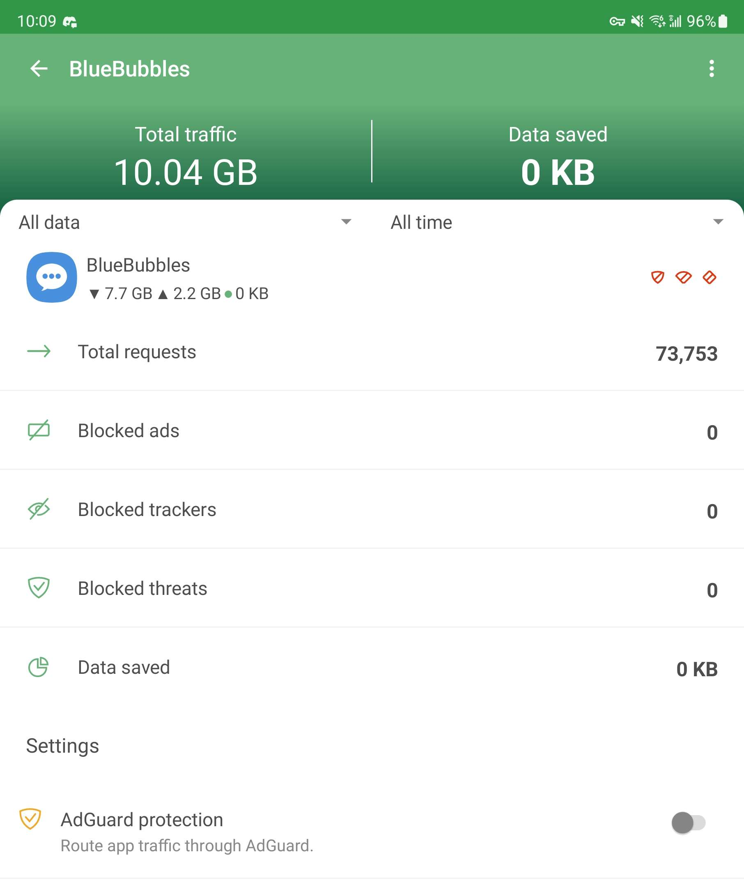

# Using BlueBubbles with Adguard

### Overview

Adguard is a local VPN on your Android device that you can use for simple DNS blocking.

Many of you are using one of BlueBubble's built in proxy services such as Cloudflare or Ngrok. Sometimes, Adguard will block these domains, and can cause connection issues between your BlueBubbles Android app and the BlueBubbles Server.

### The Fix

The fix is simple. Just open the Adguard app's settings, and disable Adguard for the BlueBubbles App.

See the screenshot below for an example of this (note the `Adguard protection` toggle is disabled):

<figure><figcaption></figcaption></figure>
