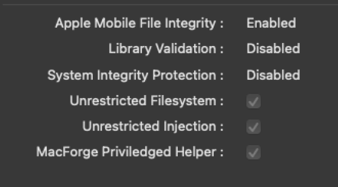

# Installation


In order to get Private API features, you must disable MacOS extra security measures, called System Integrity Protection (SIP). The reason for this is because Apple does not let us access the internal iMessage code to do things like send reactions if SIP is enabled. When disabled, we can use an app called MacForge to unlock access to these private APIs. In a way, installing MacForge is similar to Jailbreaking your iPhone and installing Cydia.



Disabling SIP can be challenging, we recommend joining our [Discord ](https://discord.gg/BdsGwREh)to get assistance with the process if you need it!



Disable SIP at your own risk! We are not responsible for any damages, issues, or glitches caused by disabling SIP or by using MacForge/mySIMBL.

If you use common sense when downloading and installing things, you should be just fine. Please be careful!



Disabling SIP on an Apple Silicon Mac disables the ability to install and run _iOS Apps_ on your Mac. If this feature is important to you, don't use the Private API.



If you are using a Virtual Machine, please **take a snapshot** before continuing! You will definitely want a failsafe in case something goes wrong.



Please ensure you have the latest BlueBubbles Server from [GitHub Releases](https://github.com/BlueBubblesApp/bluebubbles-server/releases)!


Now that the warnings are out of the way, lets proceed to the instructions!

## Supported Device Info

The Helper Bundle currently supports macOS 10.13 and up, on both Intel and Apple Silicon Macs.


It may support lower macOS versions, but we haven't been able to test them yet.


## Required Software



[mySIMBL](https://github.com/w0lfschild/mySIMBL/releases)



[MacForge](https://www.macenhance.com/macforge)



**Macforge Beta should only be used on Apple Silicon!! i.e. M1 / M1 Pro / M1 Max / M1 Ultra / M2 / etc (Macs released after late 2020)! All other CPUs and Virtual Machines should use 10.14+ (INTEL).**\
\
[MacForge Beta](https://github.com/MacEnhance/appcast/raw/master/Beta/MacForge/MacForge.1.2.0B1.zip)



## Instructions

Please follow the instructions for your macOS version in the tabs below.



1. Open Terminal on your macOS device
2.  Run the following command to disable Library Validation and enter your password when prompted.

    `sudo defaults write /Library/Preferences/com.apple.security.libraryvalidation.plist DisableLibraryValidation -bool true`
3. Run the following commands to force your Mac to reboot into recovery mode:
   * **WARNING**: _DO NOT do this step or step 4-5_ if you are running dos1dude's patched High Sierra/Mojave/Catalina. It may temporarily brick your Mac until you reset your NVRAM/PRAM
   * **If you are on **_**a real Mac with official macOS**_, do the following:
     1. **WARNING**: This will instantly reboot your Mac. Save everything before executing this command!
     2. `sudo nvram recovery-boot-mode=unused`
     3. `sudo reboot recovery`
   * **If you are using **_**a Virtual Machine or a patched macOS software**_, follow [this guide.](https://docs.bluebubbles.app/server/advanced/running-on-macos-vm/disable-sip-on-vms)
4. When you are booted into `Recovery Mode`:
   * Click on `Utilities` in the top menu bar
   * Select `Terminal`
   * Type this command and hit enter to disable SIP: `csrutil disable`
5. Restart your macOS device/server
   * Click the Apple logo in the top menu, then click `Restart`
6. Download MacForge or mySIMBL from their official site (depending on your macOS version; links above)
7. Unzip and install the MacForge/mySIMBL app (copy the app to your `Applications` folder as instructed)
8. Download the latest [BlueBubbles Helper Bundle](https://github.com/BlueBubblesApp/BlueBubbles-Server-Helper/releases) for MacForge/MySIMBL (please pay attention to macOS version on the .zip file)
9. If you have not already, unzip the ZIP file containing the `BlueBubblesHelper.bundle`
10. Follow the instructions below for either MacForge or mySIMBL
    * **If you installed **_**MacForge**_
      1. Open the `MacForge App`, then drag and drop the `.bundle` file into the `Manage Plug-ins` page/tab.
      2. This will automatically install this helper plugin. To verify, you may check under the `/Library/Application Support/MacEnhance/Plugins/` directory, where you should see `BlueBubblesHelper.bundle`
      3. Confirm that the BlueBubblesHelper plugin is toggled to `library`, and not `user`, within MacForge (the icon should show 2 people, not 1 person)
    * **If you installed **_**mySIMBL**_
      1. Open the `mySIMBL App`, then go to the `Manage` tab
      2. Click the `+` button and select the `BlueBubblesHelper.bundle`
      3. Verify that the bundle is enabled and running
11. Turn the Private API switch on in the BlueBubbles Server settings
12. Restart / start the BlueBubbles MacOS Server, and restart iMessage for good measure
13. Verify that the `BlueBubblesHelper` is detected and links to the `macOS Server App`:
    * Navigate to the debug tab, and make sure a `Helper Connected` log shows
14. Go to Settings > Private API Features on the clients you use, and toggle that on. You should now have functioning Private API Features!



1. Open Terminal on your macOS device
2.  Run the following command to disable Library Validation and enter your password when prompted.

    `sudo defaults write /Library/Preferences/com.apple.security.libraryvalidation.plist DisableLibraryValidation -bool true`
3. Follow the instructions below for your device type
   * _**Physical Mac, INTEL, official software**_
     1. Run the following commands to force your Mac to reboot into recovery mode:
        * **WARNING**: This will instantly reboot your Mac. Save everything before executing these commands!
        * `sudo nvram internet-recovery-mode=RecoveryModeDisk`
        * `sudo reboot recovery`
     2. When you are booted into `Recovery Mode`:
        * Click on `Utilities` in the top menu bar
        * Select `Terminal`
        * Type this command and hit enter to disable SIP: `csrutil disable`
     3. Click the Apple logo in the top menu bar, then click `Restart`
   * _**Physical Mac, APPLE SILICON, official software**_
     1. Do the following to force your Mac to reboot into recovery mode:
        * Shut down the Mac normally
        * Press and hold the power button on your Mac until you see "Loading startup options."
        * Click Options, then click Continue, and enter the admin password if requested.
     2. When you are booted into `Recovery Mode`:
        * Click on `Utilities` in the top menu bar
        * Select `Terminal`
        * Type this command and hit enter to disable SIP: `csrutil disable`
     3. Click the Apple logo in the top menu bar, then click `Restart`
   * _**macOS on a Virtual Machine or patched macOS software on a Physical Mac**_
     1. Follow [this guide.](https://docs.bluebubbles.app/server/advanced/running-on-macos-vm/disable-sip-on-vms)
4. Download MacForge (link above)
5. Unzip and install the MacForge app (copy the app to your `Applications` folder as instructed)
6. Download the latest [BlueBubbles Helper Bundle](https://github.com/BlueBubblesApp/BlueBubbles-Server-Helper/releases) for MacForge (please pay attention to macOS version on the .zip file)
7. If you have not already, unzip the ZIP file containing the `BlueBubblesHelper.bundle`
8. Open the `MacForge App`, then drag and drop the `.bundle` file into the `Manage Plug-ins` page/tab.
   * This will automatically install this helper plugin. To verify, you may check under the `/Library/Application Support/MacEnhance/Plugins/` directory, where you should see `BlueBubblesHelper.bundle`
   * Confirm that the BlueBubblesHelper plugin is toggled to `library`, and not `user`, within MacForge (the icon should show 2 people, not 1 person)
   * If you cannot drag and drop, visit the`/Library/Application Support/MacEnhance/Plugins/` directory in Finder and paste the `BlueBubblesHelper.bundle` into it
9. Turn the Private API switch on inside the BlueBubbles Server settings
10. Restart / start the BlueBubbles MacOS Server, and restart iMessage for good measure
11. Verify that the `BlueBubblesHelper` is detected and links to the `macOS Server App`:
    * Navigate to the debug tab, and make sure a `Private API Helper Connected` log shows
12. Go to Settings > Private API Features on the clients you use, and toggle that on. You should now have functioning Private API Features!



## Troubleshooting

Here are some basic troubleshooting steps. Please try these out, and if you need more help, feel free to join our [Discord](https://discord.gg/BdsGwREh)!

* Make sure you have the latest bundle and server versions from their respective GitHub releases page, and that you downloaded the correct bundle for your macOS version.&#x20;
* Make sure you have the Private API switch turned on in _**both**_ the server and the client app
* Try force quitting and reopening the server (with private API switch toggled on), and then force quit and reopen the iMessage app
* Make sure your bundle is toggled to "library" mode in MacForge / mySIMBL (the icon next to it should have 2 people, not 1 person)
* If you are on Apple Silicon, make sure you have Beta MacForge and that the BlueBubblesHelper bundle has a green dot for Apple Silicon.
*   Check the MacForge / mySIMBL system tab. It should show these values on Intel:

    

    or it should show all green dots on Apple Silicon.

    * If you see Library Validation enabled, try step 2 of the [#instructions](installation.md#instructions "mention") again.
    * If you see System Integrity Protection enabled, run `csrutil status` inside Terminal, then join our Discord and let us know what the output is.
    * If any of the checkboxes are not checked, make sure you are running MacForge inside an Administrator account with all privileges.

If none of this works, you should join our Discord and the developers will be able to help you out. In your post, please include your macOS version, Mac chipset (Intel / Apple Silicon), your bundle version, your server version, and a picture of the MacForge / mySIMBL system. Thanks!
