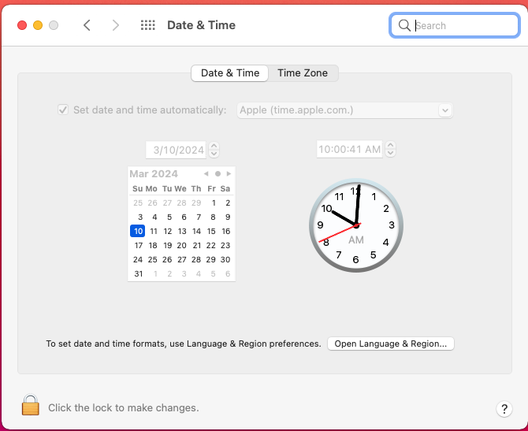

# Nginx Proxy Manager

### Requirements

* NGINX Proxy Manager with port 80 and 443 forwarded properly
* Bluebubbles server running and accessible from the machine which is running NGINX

### How to

1. Set Proxy Service to Dynamic DNS. Set your hostname to be `https://bb.yourdomain.com`
   * **Keep `Use Custom Certificate` off**
   * Ensure the local port is 1234
2. Add a new Proxy Host in NGINX
   1. Set the domain name to `bb.yourdomain.com`
   2. Set scheme to `http`
   3. Set Forward Hostname / IP to the IP address of your mac
   4. Set Forward Port to `1234`
   5. Turn on `Block Common Exploits` & `Websocket Support`
   6. Click on the SSL Tab
   7. Click on the dropdown and select `Request a new SSL Certificate`
   8. Check all 4 options
3. Your Bluebubbles instance should now be accessible at `https://bb.yourdomain.com` !

.png>)

.png>)

#### Credit

Guide created by @pablito in the BlueBubbles Discord
