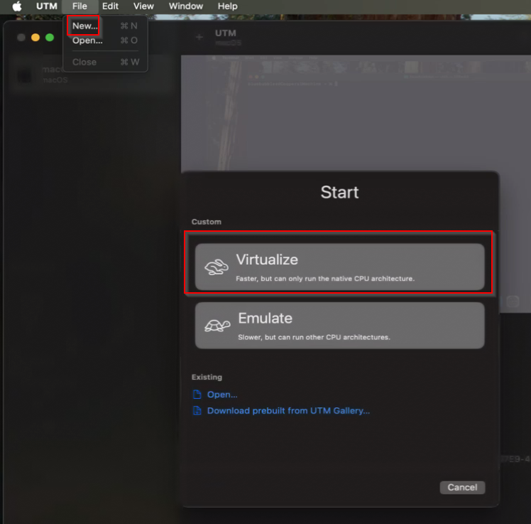
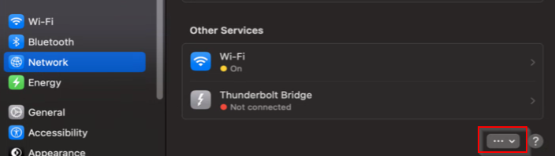
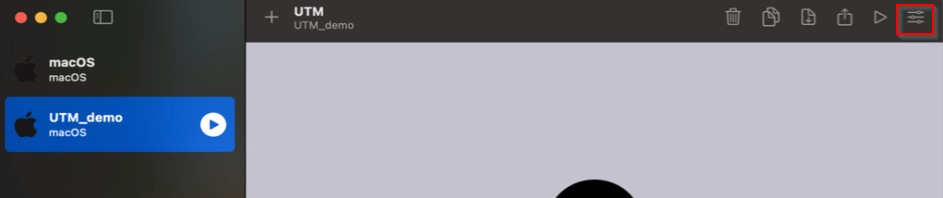

# Running BlueBubbles on macOS UTM VM

### Contribution Notes

This guide is a contribution by Cooper Marshall.  On Discord as cmarsha11.  Thanks to @JustBen for writing the Docker guide and providing a template to build from.

### Disclaimer

This guide is not for beginners.  If this is the first time you have setup a BlueBubbles server or worked with virtualization this will be difficult.  The intent of this guide is to walkthrough how to setup BlueBubbles server on a macOS VM virtualized with [UTM](https://mac.getutm.app/) running on a macOS host.  

There are several reasons for running Bluebubbles on a mac VM even if you have genuine Apple hardware:

- Security (the main reason!)
  - You can disable SIP on the VM and leave the host fully protected
  - You can provide full disk access on the VM that is only used for BlueBubbles
  - You can isolate the VM from the rest of your network without restricting permissions on the host machine

- Portabilty
  - It is easy to transfer the full UTM image to a new server

- Legal/compliance
  - Per Apple SLA, you can legally run macOS on a virtual machine IF it is running on Apple branded metal 
  - See section 2.B.iii in the macOS Sequoia SLA (https://www.apple.com/legal/sla/)
  - Don't need to worry about iCloud account being deactivated

- Open sourceness
  - UTM is completely free and open source

  
A downside with running on UTM is the Find My function is disabled.  There are probably [work arounds](https://docs.bluebubbles.app/server/troubleshooting-guides/fix-facetime-features-for-virtual-machines) but I did not test them.

This guide is provided with no guarantees or warranty. If you encounter any problems, the community may be able to provide help in the Discord but we cannot guarantee that this will work for every configuration.

This guide has only been tested with macOS Sequioa 15.4.1 (VM and host) running on Apple M2 hardware with UTM v4.6.5.

### Goal

This guide will walk you through setting up BlueBubbles on a macOS VM running on macOS hardware via UTM.

### Pre-requisites

You must have all of these already setup/installed in order to continue with the guide.

* A Mac host running Apple Silicon
  * Your system must support virtualization
* Comfortable with macOS terminal
* Software:
  * `UTM`
    * Can download for free at https://mac.getutm.app/ or build from source at https://github.com/utmapp/UTM

### Installation

1. Login to your Mac host and install UTM
1. Download a recovery IPSW from https://ipsw.me/product/Mac
1. In UTM, select File -> New, then Virtualize
    
1. Under Operating System, select macOS 12+
1. Select browse, then select your downloaded IPSW file
1. Select the memory and CPU cores (I left everything at default and it runs fine)
1. Select the storage amount
1. Name the VM and save
1. Turn on the VM (installation will take ~15 minutes)
1. Follow the setup prompts and login to your account
    1. Set up as new (unless you want to restore from backup but recommendation is to just use the VM for BlueBubbles)
    1. Create an account for your mac
    1. Sign in to your Apple account
    1. Continue with the rest of the setup

### Installing BlueBubbles server

1. Once the VM is up, follow the steps at https://bluebubbles.app/install/ to install BlueBubbles server
1. For remote access Cloudflare with custom domain is very easy and more secure than a generic port forward. It was simple to setup and you can lock down the tunnel with custom header tokens.  https://docs.bluebubbles.app/server/advanced/byo-proxy-service-guides/cloudflare-with-a-custom-domain

### Enable private API

1. To install the BlueBubbles Private API features, just follow the normal guide [here](https://docs.bluebubbles.app/private-api/installation).
1. When disabling SIP, follow the instructions under macOS 11+ (Big Sur+) for "Physical Mac, APPLE SILICON, official software" on the Private API installation documentation.

### Securing the macOS VM with VLAN isolation

One method to secure the VM is to run it on an isolated VLAN.  Below are the steps to add the VM to an isolated VLAN.  The VLAN needs to be created beforehand.  Follow the steps for your specific router/LAN to create a VLAN.

1. Login to the MacOS Host machine and open settings
1. Select `Network`, then the three dots under other services
    
1. Select `Manager Virtual Interfaces...`
1. Select the `+` (plus) sign in the bottom left, then `New VLAN`
1. Name the VLAN and enter the tag of your restricted VLAN.  For   `Interface` select your network interface
1. Power off the VM
1. On UTM, select the settings icon
    
1. Select `Network`
1. Under `Network Mode` select `Bridged (Advanced)`
1. Under `Interface` select the VLAN you created earlier
1. Turn the VM back on.  If your VLAN has DHCP setup it will pull an IP.  Otherwise assign a static IP in the range
1. If the VLAN is properly isolated you should no longer be able to reach the host from the VM.  All traffic will be routed out of the VM through the VLAN to the router.
    1. Note that this breaks `Detect Localhost Address`
1. To enable `Detect Localhost Address`, create a firewall rule
    1. Allow any for source
    1. Only allow your VM IP and port for destination (default port is usually 1234 but can be changed in settings)
    1. This will allow machines on the network to bypass port forwarding or BYO proxies when on the LAN but still restrict the VM from communicating with other machines on your network and the host
